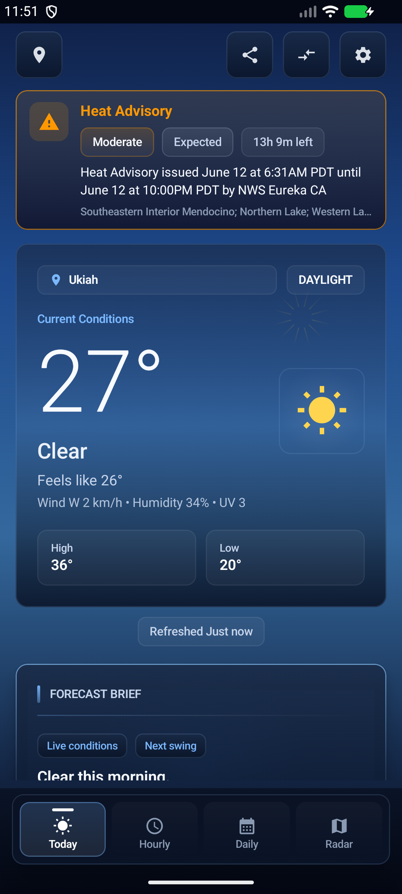
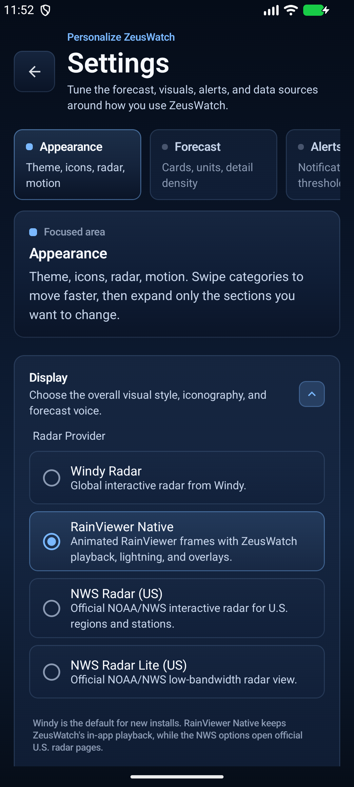
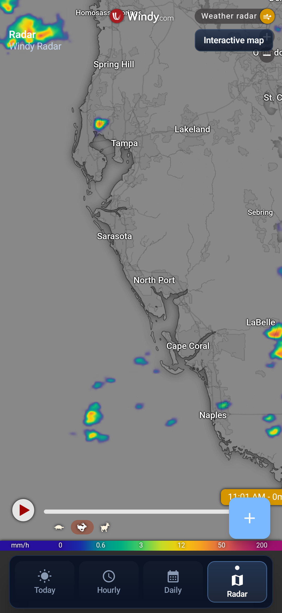

# ZeusWatch


> A free, open-source Android weather app with a premium dark UI, 37 customizable cards, animated Lottie icons, Gemini Nano AI summaries, multi-source forecasts, route weather planning, custom alert rules, and smart alerts. No API keys required for core forecasts. Powered by Open-Meteo, FMI, LibreWXR, RainViewer, Blitzortung, NWS, MeteoAlarm, JMA, MET Norway, Environment Canada, Hong Kong Observatory, BMKG, WMO SWIC, and optional WeatherFlow Tempest PWS observations.


## Screenshots

| Today | Settings | Radar |
|-------|----------|-------|
|  |  |  |

## Quick Start

```bash
git clone https://github.com/SysAdminDoc/zeuswatch.git
cd zeuswatch
./gradlew assembleStandardDebug
```

Install the APK from `app/build/outputs/apk/standard/debug/` or open in Android Studio and run directly.

**Requirements:** Android Studio with AGP 9.2 support, JDK 17+, Android SDK 37.0

### Download

Releases publish per-ABI APKs to reduce download size:

| APK | Size | Use when |
|-----|------|----------|
| `ZeusWatch-standard-arm64-v8a` | ~20 MB | Most modern phones (2017+) |
| `ZeusWatch-standard-armeabi-v7a` | ~17 MB | Older 32-bit devices |
| `ZeusWatch-standard-universal` | ~49 MB | Unsure which ABI you need |
| `ZeusWatch-freenet-*` | Same variants | F-Droid compatible (no Google Play Services) |
| `ZeusWatch-wear` | ~5 MB | Wear OS companion watch app |

Download from [GitHub Releases](https://github.com/SysAdminDoc/zeuswatch/releases).

### Verify Downloads

Release APK signing certificate SHA-256:

```text
FB:03:10:AA:52:0F:6C:C6:EB:DA:04:61:71:9E:A9:22:40:EA:2B:4A:A1:D0:15:79:A9:D1:8A:F5:A9:5F:A7:CD
```

For every release, verify the checksum file and APK signatures locally:

```bash
cat ZeusWatch-vX.Y.Z-provenance.json
sha256sum -c SHA256SUMS.txt
apksigner verify --verbose --print-certs ZeusWatch-standard-arm64-v8a-vX.Y.Z.apk
apksigner verify --verbose --print-certs ZeusWatch-freenet-arm64-v8a-vX.Y.Z.apk
apksigner verify --verbose --print-certs ZeusWatch-wear-vX.Y.Z.apk
```

The provenance JSON records the source commit, clean-tree state, toolchain versions, APK hashes, signing certificate SHA-256, and local verification commands used for the release.

---

## Features

### Core Weather

| Feature | Description |
|---------|-------------|
| **Current Conditions** | Large temp display, feels-like with wind chill/heat index explanation, condition, high/low, sky gradients |
| **Yesterday Comparison** | "5° warmer than yesterday" label in hero header with color-coded warm/cool indicator |
| **Weather Summary** | Time-aware natural language forecast ("Clear skies this morning") via Gemini Nano through ML Kit GenAI Prompt API (default) or template engine, with UV/humidity warnings |
| **Hourly Forecast** | 72h scrollable strip with temp, animated Lottie icons, wind direction arrows, precip probability, smart rain timeline ("Rain likely within 3h"), feels-like when significantly different |
| **16-Day Forecast** | Expandable daily rows with temperature range bars, rain hours, sunshine, snowfall, wind gusts, UV max. "Warmest" day highlighted |
| **Temperature Graph** | Interactive Canvas graph with drag-to-inspect, precipitation bars, forecast average normals band, optional confidence bands, and detail-sheet uncertainty explanations |
| **Rain Next Hour** | 60-minute precipitation nowcasting bar chart from Open-Meteo minutely_15 data |
| **Temperature Normals** | Shaded band on temperature graph showing forecast average range with dashed boundary lines |

### Data & Visualization

| Feature | Description |
|---------|-------------|
| **Today's Details** | 10+ cell grid: humidity, wind (with gusts), UV, pressure (with trend indicator), visibility, dew point (with comfort descriptor), sunrise/sunset, cloud cover, snowfall/snow depth |
| **Wind Compass** | Animated Canvas compass with direction needle, Beaufort scale coloring, gust display |
| **UV Index Bar** | Color gradient bar with level markers, descriptions, "UV peaks at 2 PM" annotation, and safe sun exposure time |
| **Air Quality** | PM2.5, PM10, O3, NO2, SO2, CO with EPA/European AQI scales, circular gauge, dominant pollutant highlighting, and 5-day daily AQI forecast bars |
| **Pollen Data** | Per-species animated bars: alder, birch, grass, mugwort, olive, ragweed (hourly fallback) |
| **Moon Phase** | Canvas moon illumination with Conway's algorithm, moonrise/moonset, day length, sunrise/sunset countdown |
| **Sun Arc** | Semicircular sun position visualization with "Sunset in 2h 15m" countdown |
| **Snowfall Card** | Current snowfall rate + snow depth + daily total, auto-hidden when no snow |
| **Sunshine Duration** | Today's sunshine hours with circular progress ring |
| **Severe Weather Potential** | CAPE-based thunderstorm indicator with instability levels |
| **Outdoor Activity Score** | Weighted 0-100 composite score from temp, wind, UV, humidity, precipitation, AQI with factor breakdown bars |
| **Golden Hour** | Morning and evening golden hour times for photographers |
| **Humidity & Comfort** | Humidity gauge with comfort level indicator, dew point, and zone markers |
| **Precipitation Forecast** | 24-hour precipitation probability bars with peak callout and accumulation total |
| **Pressure Trend** | 24-hour barometric pressure line graph with trend direction and delta |
| **Wind Forecast** | 24-hour wind speed line graph with gust overlay bars and peak callout |
| **Forecast Evolution** | Optional Open-Meteo Single Runs card compares recent model runs for temp/rain-risk deltas |
| **Provider Agreement** | Optional card compares next-24h temperature and precipitation across 2-3 forecast providers with agreement/divergence badges |
| **Tempest PWS** | Optional WeatherFlow Tempest card listens for one-minute observations from the user's own station |
| **Clothing Suggestions** | Rule-based outfit recommendations from feels-like temp, rain, snow, UV, wind |
| **Pet Safety** | Pavement temperature estimates, heat stress, cold exposure, storm anxiety alerts |

### Smart Alerts & Safety

| Feature | Description |
|---------|-------------|
| **Severe Weather Alerts** | Multi-source: NWS (US), MeteoAlarm (31 EU countries), JMA (Japan), Environment Canada, Hong Kong Observatory (selectable for HK), BMKG (Indonesia), WMO SWIC (130+ countries global fallback), Pirate Weather (with API key) |
| **Alert Source Preference** | Configurable country routing: Auto-detect, NWS only, MeteoAlarm, JMA, Environment Canada, All sources; Data Sources can also select Hong Kong Observatory and BMKG |
| **4 Notification Channels** | Extreme (alarm sound, bypass DND), Severe (high), Moderate (default), Minor (low) |
| **Alert Deduplication** | Tracks seen alert IDs so the same warning is never re-notified |
| **Multi-Location Alerts** | Monitors all saved locations by default, not just current GPS |
| **Progress Nowcast Notifications** | Android 16+ nowcast alerts use ProgressStyle segments for dry/light/steady/heavy rain timelines, with BigText fallback on older devices |
| **Driving Condition Alerts** | Black ice, fog, low visibility, hydroplaning, high wind, snow/ice — derived from forecast data |
| **Route Weather Planner** | Enter or share a route from Radar, choose departure timing, and review waypoint precipitation, wind, visibility, ice, and alert risk without background tracking |
| **Health Alerts** | Migraine triggers (pressure/temp swings, configurable threshold), respiratory (humidity extremes), arthritis (temp swing) |
| **Haptic Feedback** | Severity-appropriate vibration patterns when alerts display |
| **Expired Alert Filtering** | Skips alerts past their expiration timestamp |
| **Custom Alert Rules** | User-defined thresholds: today's high/low, wind gusts, 24h rain, UV peak. Hourly background evaluation with per-rule dedupe. Separate notification channel |
| **Pressure Trend** | Rising/Falling/Steady indicator computed from hourly surface pressure data |

### Radar & Maps

| Feature | Description |
|---------|-------------|
| **Radar Providers** | User-selectable: Windy Radar WebView, LibreWXR Native MapLibre playback with nowcast tiles (max zoom 12, Viper HD), RainViewer Native MapLibre playback with past-radar tiles (max zoom 7, Universal Blue), NWS Radar (US), or NWS Radar Lite (US) |
| **Animated Radar Playback** | Play/pause, frame slider, recent-past labels, timestamp overlay, cached frame metadata fallback (native mode) |
| **Radar Preview Card** | Recent selected native radar tile + CartoDB dark basemap on the Today tab |
| **Radar Tab** | Full-screen radar in the bottom nav with provider-aware rendering |
| **Route Weather Overlay** | Radar includes a foreground route planner for sampled waypoint weather and risk timing |
| **Map Layer Selector** | Overlay layers: Radar, Lightning, Satellite, Clouds |
| **Active Warning Polygons** | Native radar renders NWS warning polygons with severity colors and tappable alert details |
| **Lightning Strike Overlay** | Real-time global lightning data via Blitzortung WebSocket with capped GeoJSON rendering and reconnect backoff |
| **Community Weather Reports** | Firebase Firestore-backed crowd-sourced condition reporting with rate limiting |

### Multi-Source Forecast System

| Source | Data Types | Region |
|--------|------------|--------|
| **Open-Meteo** | Forecast, AQI, Pollen, Minutely, Historical, Single Runs | Global |
| **Open-Meteo Models** | BOM ACCESS-G, UK Met Office, DMI HARMONIE, Meteo-France forecast/AROME nowcast sources | Australia, UK/North Atlantic, Northern Europe, France/Central Europe |
| **Finnish Meteorological Institute** | HARMONIE WFS forecast | Finland / Nordic-Baltic region |
| **NWS** | Alerts | United States |
| **MeteoAlarm** | Alerts | 31 EU countries |
| **JMA** | Alerts | Japan |
| **MET Norway** | Forecast | Global |
| **Environment Canada** | Forecast, Alerts | Canada |
| **Hong Kong Observatory** | Forecast, Alerts | Hong Kong |
| **BMKG** | Alerts | Indonesia |
| **GeoSphere Austria** | INCA 15-minute nowcast, Alerts | Austria / Alpine region |
| **WMO SWIC** | Alerts | Global fallback by country |
| **OpenWeatherMap** | Forecast (fallback) | Global (API key) |
| **Pirate Weather** | Forecast (fallback) | Global (API key) |
| **Bright Sky** | Forecast (fallback) | Germany |

The `WeatherSourceManager` supports primary + fallback source per data type with automatic failover. Sources are configurable globally in Settings, saved locations can override forecast and alert providers from the Locations screen, and Settings > Data Sources shows local provider health with a redacted diagnostics export for support.

Forecasts are cached as normalized `WeatherData` per location and provider, so saved-location switches can render cached conditions immediately while the selected source refreshes in the background. Open-Meteo's older response cache is retained only as a migration fallback for Open-Meteo reads.

Settings > Data Sources includes an opt-in Open-Meteo FlatBuffers mode. When enabled, the main Open-Meteo forecast and historical On This Day archive calls request `format=flatbuffers`, decode through `com.open-meteo:sdk`, and automatically fall back to the existing JSON path if the binary response cannot be fetched or decoded.

Settings > Data Sources also includes an opt-in read-only ecosystem ContentProvider at `content://com.sysadmindoc.nimbus.provider.weather/` with Breezy-compatible `version`, `locations`, and `weather` paths for Tasker, KWGT, and similar tools. External queries require the `com.sysadmindoc.nimbus.READ_PROVIDER` permission and read cached data only; they never trigger live network refreshes.

When providers publish localized condition or alert text, matching user-locale source wording is preferred before falling back to app WMO labels.

### Widgets (Jetpack Glance)

| Widget | Size | Content |
|--------|------|---------|
| **Current** | 3x1 | Icon + temp + location + high/low |
| **3-Day** | 3x2 | Current conditions + 3-day forecast columns + staleness indicator |
| **Forecast** | 4x3 | Current + 6hr hourly strip + 5-day rows + staleness indicator |
| **Hourly Strip** | 4x1 | Current temp + next 5 hourly temps with icons and precip% |
| **Saved Cities** | 4x3/4x4 | Up to 5 saved locations with cached temperature and condition |
| **Temperature** | 1x1/2x1 | Compact icon + current temperature |
| **Compact** | 2x1 | Icon, temperature, location, and updated state |
| **Daily** | 4x2 | Five-day outlook rows with high/low and condition icons |

- Per-widget location configuration via config activity
- Tap-to-refresh from freshness badges and empty states; tap widget body to open the app when loaded
- Proactive background caching for all saved locations
- Material You theming with `GlanceTheme`

### Customization

| Setting | Options |
|---------|---------|
| **Radar Provider** | Windy Radar / LibreWXR Native / RainViewer Native / NWS Radar (US) / NWS Radar Lite (US) |
| **Icon Style** | Meteocons Animated (Lottie, default) / Material Icons / Custom Icon Packs |
| **Theme Mode** | Static Dark / Weather Adaptive (accent colors shift: amber for sun, blue for rain, purple for storms) |
| **Weather Summary** | AI-Generated (Gemini Nano, default) / Standard template |
| **Card Visibility** | Toggle each of the 37 card types on/off |
| **Card Ordering** | Reorderable card list in Settings with move up/down arrows |
| **Temperature** | Fahrenheit / Celsius |
| **Wind Speed** | mph / km/h / m/s / knots |
| **Pressure** | inHg / hPa / mbar |
| **Precipitation** | inches / mm |
| **Visibility** | miles / km |
| **Time Format** | 12-hour / 24-hour |
| **Hourly Range** | 72 hours (default) / 48 hours |
| **Notifications** | Alert notifications, persistent weather notification (default on), nowcasting alerts with Android 16 progress timelines, driving alerts, health alerts |
| **Alert Severity** | Extreme only / Severe+ / Moderate+ / All |
| **Alert Source** | Auto-detect / NWS / MeteoAlarm / JMA / Environment Canada / All, plus Hong Kong Observatory and BMKG through Data Sources |
| **Data Toggles** | Snowfall, CAPE, sunshine duration, golden hour, Beaufort colors, outdoor score, yesterday comparison |
| **Health** | Migraine alerts with configurable pressure threshold (3.0/5.0/7.0/10.0 hPa/3h) |
| **Haptics** | Vibration feedback for weather alerts |
| **Weather Particles** | Rain, snow, and sun ray animations on/off |
| **Cache TTL** | Configurable: 15 / 30 / 60 / 120 minutes |
| **Source Diagnostics** | Local provider success/failure history, cache age, active fallback state, and redacted support export |

### More

| Feature | Description |
|---------|-------------|
| **Compare Weather** | Side-by-side comparison with weather icons, visibility, cloud cover, value highlighting, and a provider chart overlay for hourly temperature/rain divergence |
| **Location Search** | Open-Meteo geocoding with debounced search and error feedback |
| **Multi-Location** | Room database with add/remove/auto-GPS saved locations |
| **Drag-to-Reorder Locations** | Long-press drag handles to reorder saved locations with batch persistence |
| **Location Temperature Preview** | Saved location list shows cached temperatures with weather condition icons |
| **Per-Location Sources** | Saved locations can override forecast and alert providers while falling back to the app defaults when unset |
| **Provider-Aware Offline Cache** | Saved locations keep source-specific cached forecasts for immediate offline-first rendering before background refresh |
| **Share as Text** | Formatted weather summary via system share sheet |
| **Share as Image** | Rendered dark-themed weather card as PNG |
| **Persistent Notification** | Always-on notification showing current conditions (toggleable) |
| **Proactive Caching** | Background worker pre-fetches weather for all saved locations |
| **Offline Mode** | Room-cached weather data survives network failures with "Cached" indicator |
| **Adaptive Layout** | Phone and tablet layouts via LazyColumn. Tablets get two-pane weather + radar (840dp+) |
| **Live Weather Wallpaper** | Rain, snow, thunderstorm, sun rays, cloud wisps, fog particle effects over existing wallpaper |
| **Wear OS Companion** | Watch app, Material3 animated weather tile, and complications for temperature, condition/high-low, UV, and icon slots |
| **Smartspacer Plugin** | Optional Smartspacer target and temperature complication read the ZeusWatch cache for Pixel At a Glance-style current conditions |
| **Ecosystem ContentProvider** | Optional Breezy-compatible read-only provider exposes saved locations and cached forecasts to Tasker, KWGT, and similar tools with an Android permission gate |
| **Premium State Polish** | Focused, pressed, disabled, loading, empty, and recovery states use consistent dark glass chrome across phone, widgets, and Wear OS |
| **Accessibility** | TalkBack descriptions on all Canvas components, alert icons, non-color risk cues on color-coded weather surfaces, and merged card semantics with liveRegion alerts |
| **Localization Foundation** | Core navigation, Today shell states/card headers/card microcopy/alert dialogs/report sheet, Settings controls/enums, Home Card labels, Custom Alerts, Locations, Compare, widgets, and Wear OS state copy use Android string resources with Spanish plus Arabic/Hebrew RTL resources; provider-native condition and alert text is preferred when upstream language matches the user's locale |
| **App Shortcuts** | Long-press launcher: Search, Radar, Settings, Compare |
| **Deep Links** | `zeuswatch://` URI scheme for locations, radar, settings, compare |
| **F-Droid Ready** | `freenet` build flavor with no proprietary dependencies |
| **Custom Icon Packs** | Discover bundled + external APK icon packs via intent |
| **Alert Expiry Countdown** | Alert banners show "3h 15m left" / "Expired" |
| **Sunrise/Sunset Countdown** | Astronomy card shows "Sunset in 2h 15m" with auto-switch |
| **Smart Rain Timeline** | Hourly strip shows "Rain likely within 3h" or "Rain ending soon" |
| **Data Staleness Indicator** | "Updated" text turns amber when data is 1+ hours old |
| **Wind Direction Arrows** | Hourly forecast items show wind direction when > 10 km/h |
| **Dew Point Comfort Colors** | Color-coded comfort level (blue=dry, green=comfortable, orange=muggy, red=oppressive) |
| **Time-Aware Summary** | "Clear skies this morning" / "Overcast this afternoon" / "tonight" |
| **Collapsible Settings** | All sections collapsible with tap-to-toggle, Data Sources + Advanced start collapsed |

---

## Architecture

```
┌──────────────────────────────────────────────────────────────────────────┐
│  UI Layer (Jetpack Compose)                                              │
│  ┌──────────┐ ┌──────────┐ ┌──────────┐ ┌──────────┐ ┌──────────────┐  │
│  │MainScreen│ │RadarScreen│ │ Settings │ │Locations │ │CompareScreen │  │
│  │+ViewModel│ │+ViewModel │ │ + VM     │ │+ VM      │ │+ ViewModel   │  │
│  └────┬─────┘ └────┬─────┘ └────┬─────┘ └────┬─────┘ └──────┬───────┘  │
│       │            │            │            │               │           │
│  37 Card Types via LazyColumn items()                                    │
│  WeatherSummary | NowcastCard | RadarPreview | HourlyStrip | TempGraph  │
│  DailyForecast | UvIndexBar | WindCompass | AqiCard | PollenCard | ...   │
│  ClothingSuggestion | PetSafety | DrivingAlert | HealthAlert | ...      │
│                                                                          │
├──────────────────────────────────────────────────────────────────────────┤
│  Domain Layer (Repositories + Evaluators + Source Manager)               │
│  ┌────────────────┐ ┌──────────────────┐ ┌───────────────────────────┐  │
│  │WeatherRepo     │ │WeatherSource     │ │AlertRepo + AlertSource   │  │
│  │(fetch+cache+   │ │Manager (primary/ │ │Adapters (NWS, MeteoAlarm,│  │
│  │ direct+history)│ │fallback adapters)│ │JMA, ECCC)                │  │
│  └────────────────┘ └──────────────────┘ └───────────────────────────┘  │
│  ┌────────────┐ ┌───────────┐ ┌────────────┐ ┌────────────────┐        │
│  │AirQuality  │ │LocationRepo│ │RadarRepo   │ │Community       │        │
│  │Repo(AQ+   │ │(geocode+   │ │(LibreWXR/  │ │ReportRepo      │        │
│  │pollen)    │ │Room+sort)  │ │RainViewer) │ │(Firestore)     │        │
│  └───────────┘ └────────────┘ └────────────┘ └────────────────┘        │
│  ┌──────────────────┐ ┌──────────────────┐ ┌──────────────────────┐    │
│  │WeatherSummary    │ │ClothingSuggestion│ │DrivingCondition      │    │
│  │Engine (NLG/AI)   │ │Evaluator         │ │Evaluator + HealthEval│    │
│  └──────────────────┘ └──────────────────┘ │+ PetSafetyEvaluator │    │
│                                             └──────────────────────┘    │
│                                                                          │
├──────────────────────────────────────────────────────────────────────────┤
│  Data Layer                                                              │
│  ┌───────────────────────────────┐  ┌───────────────────────────────┐   │
│  │ Retrofit APIs                  │  │ Room Database (v3)             │   │
│  │  Open-Meteo Forecast           │  │  weather_cache                │   │
│  │  Open-Meteo Geocoding          │  │  saved_locations (+sources)   │   │
│  │  Open-Meteo Air Quality        │  │                               │   │
│  │  Open-Meteo minutely_15        │  │ DataStore + encrypted keys    │   │
│  │  Open-Meteo Historical         │  │  Units, display, cards,       │   │
│  │  Open-Meteo Single Runs        │  │  notifications, health,       │   │
│  │  LibreWXR / RainViewer Radar   │  │  source defaults, haptics,    │   │
│  │  NWS / MeteoAlarm / JMA / ECCC │  │  seen alert IDs, widgets      │   │
│  │  Blitzortung WebSocket         │  │  widget location prefs       │   │
│  │  Firebase Firestore             │  │                               │   │
│  └───────────────────────────────┘  └───────────────────────────────┘   │
│                                                                          │
│  DI: Hilt (NetworkModule + DatabaseModule)                               │
│  Background: AlertCheckWorker + WidgetRefreshWorker (WorkManager)        │
│  Notifications: 4 alert channels + 1 persistent weather channel          │
└──────────────────────────────────────────────────────────────────────────┘
```

**Stack:** Gradle 9.4.1, AGP 9.2.0, Kotlin 2.3.21, Jetpack Compose (BOM 2026.06.01), Hilt 2.60, Retrofit 3.0.0, OkHttp 5.3.2, Room 2.7.2, DataStore 1.2.1 with Tink-encrypted API keys, Open-Meteo SDK 1.10.0 FlatBuffers decoder, Smartspacer SDK 1.1.2, ML Kit GenAI Prompt 1.0.0-beta2, MapLibre 13.3.1, Glance 1.1.1, WorkManager 2.11.2, Lottie 6.7.1, Coil 3.1.0, Firebase Firestore (BOM 34.12.0)

---

## APIs

All core APIs are free with no keys required:

| API | Purpose | Rate Limit |
|-----|---------|------------|
| [Open-Meteo Forecast](https://open-meteo.com/) | Current, hourly (48-72h), daily (16d), optional FlatBuffers payloads, minutely_15 nowcasting | 10,000/day |
| [Open-Meteo model forecasts](https://open-meteo.com/en/docs/dmi-api) | No-key regional model forecast sources: BOM ACCESS-G, UK Met Office, DMI HARMONIE | No key required |
| [Open-Meteo Historical](https://open-meteo.com/en/docs/historical-weather-api) | Yesterday's weather for comparison and On This Day archive data, with optional FlatBuffers payloads | 10,000/day |
| [Open-Meteo Single Runs](https://open-meteo.com/en/docs/single-runs-api) | Optional forecast-evolution model-run comparison | No key required |
| [Open-Meteo Geocoding](https://open-meteo.com/en/docs/geocoding-api) | Location search + reverse geocode | 10,000/day |
| [Open-Meteo Air Quality](https://open-meteo.com/en/docs/air-quality-api) | AQI, pollutants, pollen (6 species), 5-day daily forecast | 10,000/day |
| [LibreWXR](https://librewxr.net/) | FOSS radar tile source with RainViewer-compatible metadata, Viper HD color scheme, max zoom 12, and nowcast frames | CC-BY-4.0 data |
| [RainViewer](https://www.rainviewer.com/api/weather-maps-api.html) | Past radar tile images only (past 2h, max zoom 7, Universal Blue PNG; no nowcast/satellite) | Fair use |
| [Windy.com](https://www.windy.com/) | Embedded interactive radar (WebView option) | Fair use |
| [NWS Alerts](https://www.weather.gov/documentation/services-web-api) | US severe weather alerts | Fair use |
| [MeteoAlarm](https://www.meteoalarm.org/) | EU severe weather alerts (31 countries) | Fair use |
| [JMA](https://www.jma.go.jp/) | Japan severe weather alerts | Fair use |
| [Environment Canada](https://weather.gc.ca/) | Canadian severe weather alerts | Fair use |
| [Hong Kong Observatory](https://www.hko.gov.hk/en/weatherAPI/doc/files/HKO_Open_Data_API_Documentation.pdf) | Hong Kong current conditions, 9-day forecast, and weather warnings | Free open data |
| [BMKG](https://data.bmkg.go.id/peringatan-dini-cuaca/) | Indonesian CAP nowcast weather alerts | No key required |
| [WMO SWIC](https://severeweather.wmo.int/) | Global severe weather alert fallback | Fair use |
| [FMI Open Data](https://en.ilmatieteenlaitos.fi/open-data) | Nordic/Baltic HARMONIE WFS forecast | No key required |
| [MET Norway](https://api.met.no/weatherapi/locationforecast/2.0/documentation) | Forecast fallback | Fair use |
| [Bright Sky](https://brightsky.dev/) | Germany forecast fallback | Fair use |
| [Blitzortung](https://www.blitzortung.org/) | Real-time lightning strike data (WebSocket) | Fair use |
| [Firebase Firestore](https://firebase.google.com/) | Community weather reports | Free tier |

Optional fallback sources (require API keys configured in Settings):

| API | Purpose |
|-----|---------|
| [OpenWeatherMap](https://openweathermap.org/api) | Forecast fallback |
| [Pirate Weather](https://pirateweather.net/) | Forecast fallback |
| [WeatherFlow Tempest](https://apidocs.tempestwx.com/reference/quick-start) | Personal station observations |

OpenWeatherMap and Pirate Weather keys plus WeatherFlow Tempest access tokens are stored in an encrypted DataStore backed by Tink and Android Keystore. Existing plaintext keys migrate automatically on first launch.

Community reports use an anonymous append-only Firestore model: users can read reports and submit new condition reports, but reports cannot be updated or deleted after submission. Reports are stored **without an owner id** so readers cannot correlate one account's reports into a movement history; the server-side per-account 5-minute write-rate limit is enforced entirely through a separate per-uid throttle ledger. Collection reads are capped server-side to a bounded page size (no whole-collection firehose), and nearby report lookups use geohash ranges plus exact-distance filtering so dense reports on the same latitude cannot hide truly nearby reports. `firestore.rules` validates coordinates, geohash shape, condition enum values, timestamp freshness, note length, and the query page-size bound. The `standard` flavor installs Firebase App Check before Firestore/Auth access: debug builds use the Firebase debug provider and release builds use Play Integrity. Firebase enforcement is still a console-side switch; enable Firestore App Check enforcement only after registering the app, reviewing request metrics, and configuring Play Integrity settings for non-Play distribution if needed. The `freenet` flavor is unaffected and uses a no-op community report repository with no Firebase dependency.

### Open-Meteo Parameters Used

**Current:** temperature, humidity, feels-like, weather code, wind (speed/direction/gusts), pressure, UV, visibility, dew point, cloud cover, precipitation, snowfall, snow depth, CAPE

**Hourly:** All current params + precipitation probability, sunshine duration, surface pressure (48-72h configurable)

**Daily:** Weather code, temp high/low, sunrise/sunset, UV max, wind speed max/gusts max/direction dominant, precipitation sum/probability/hours, snowfall sum, sunshine duration (16d)

**Minutely_15:** Precipitation (24 intervals = 6 hours of 15-min resolution)

---

## Build Flavors

| Flavor | Description |
|--------|-------------|
| `standard` | Includes Google Play Services for FusedLocationProvider + Gemini Nano through ML Kit GenAI Prompt |
| `freenet` | F-Droid compatible — no proprietary dependencies (uses Android LocationManager) |

```bash
# Standard (Google Play)
./gradlew assembleStandardRelease

# F-Droid
./gradlew assembleFreenetRelease
```

---

## Project Structure

```
app/src/main/java/com/sysadmindoc/nimbus/
├── MainActivity.kt              # Deep links, WindowSizeClass, theme wiring
├── NimbusApplication.kt         # Hilt, WorkManager, notification channels
├── data/
│   ├── api/                     # Retrofit services (8), Room DAOs, database
│   ├── model/                   # Domain models, Room entities, API DTOs
│   ├── repository/              # Repositories, UserPreferences, CardConfig
│   │   ├── WeatherRepository    # Direct fetch + cache + history + minutely
│   │   ├── WeatherSourceManager # Multi-source primary/fallback adapter system
│   │   ├── AlertRepository      # Country-auto-detecting multi-source alerts
│   │   ├── AirQualityRepository # AQI + pollen + 5-day daily forecast
│   │   ├── LocationRepository   # Geocoding + Room + reordering
│   │   ├── RadarRepository      # LibreWXR/RainViewer tile URLs + frame list
│   │   ├── DrivingRouteWeatherPlan # Route waypoint weather/risk model
│   │   └── CommunityReportRepo  # Firestore crowd-sourced reports
│   └── location/                # GPS location provider, reverse geocoder
├── di/                          # Hilt modules (Network, Database)
├── ui/
│   ├── component/               # 30+ reusable Compose components
│   │   ├── WeatherSummaryCard   # NLG / AI-generated summary
│   │   ├── NowcastCard          # 60-min precipitation chart
│   │   ├── RadarPreviewCard     # Live radar tile
│   │   ├── TemperatureGraph     # Interactive drag-to-inspect graph + normals band
│   │   ├── OutdoorScoreCard     # Activity score gauge
│   │   ├── DrivingAlertCard     # Driving hazard alerts
│   │   ├── HealthAlertCard      # Health trigger alerts
│   │   ├── ClothingSuggestionCard # Outfit recommendations
│   │   ├── PetSafetyCard        # Pet weather safety alerts
│   │   ├── GoldenHourCard       # Photography times
│   │   ├── SunMoonArc           # Sun position visualization
│   │   ├── AqiGauge             # Circular AQI gauge + daily forecast
│   │   ├── AnimatedWeatherIcon  # Material/Lottie/Custom switcher
│   │   ├── HumidityCard         # Humidity gauge with comfort
│   │   ├── RadarLayerSelector   # Map overlay layer chips
│   │   ├── AlertBanner          # Pulsing severity-colored alert bar
│   │   └── ...                  # 14 more components
│   ├── screen/
│   │   ├── main/                # Today/Hourly/Daily tabs + tablet two-pane
│   │   ├── radar/               # Dual-provider radar + playback + layers + route weather planner
│   │   ├── settings/            # Entry shell + extracted section/control composables
│   │   ├── locations/           # Search + drag-to-reorder saved locations
│   │   └── compare/             # Side-by-side weather comparison
│   ├── navigation/              # NavHost with typed routes
│   └── theme/                   # Colors, typography, weather-adaptive themes
├── util/                        # 12 utility classes
│   ├── WeatherSummaryEngine     # Template-based NLG
│   ├── GeminiNanoSummaryEngine  # On-device AI summaries (standard flavor)
│   ├── WeatherFormatter         # 30+ unit-aware format methods
│   ├── DrivingConditionEvaluator# Ice, fog, hydroplaning, wind detection
│   ├── HealthAlertEvaluator     # Migraine, respiratory, arthritis triggers
│   ├── ClothingSuggestionEvaluator # Outfit recommendation engine
│   ├── PetSafetyEvaluator      # Pet weather hazard detection
│   ├── MeteoconMapper           # WMO code to Lottie filename mapping
│   ├── HapticHelper             # Severity-based vibration patterns
│   ├── AlertNotificationHelper  # Alert + nowcast progress notifications
│   ├── WeatherNotificationHelper# Persistent current-weather notification
│   ├── AlertCheckWorker         # Background alert monitoring
│   ├── AccessibilityHelper      # TalkBack descriptions
│   ├── ShareWeatherHelper       # Text + image sharing
│   ├── IconPackManager          # Bundled + external icon pack discovery
│   └── BlitzortungService       # Real-time lightning WebSocket
├── wallpaper/
│   └── WeatherWallpaperService  # Live weather wallpaper with particle effects
├── widget/                      # 8 Glance home screen widgets
│   ├── NimbusSmallWidget        # 3x1: temp + icon
│   ├── NimbusMediumWidget       # 3x2: current + 3-day
│   ├── NimbusLargeWidget        # 4x3: hourly + 5-day
│   ├── NimbusForecastStripWidget# 4x1: hourly temp strip
│   ├── NimbusSavedCitiesWidget  # 4x3/4x4: saved-city overview
│   ├── NimbusTempWidget         # compact temp-only surface
│   ├── NimbusCompactWidget      # 2x1 compact current conditions
│   ├── NimbusDailyWidget        # 4x2 daily outlook
│   ├── WidgetRefreshWorker      # Periodic refresh + proactive caching
│   ├── WidgetRefreshAction      # Tap-to-refresh Glance callback
│   ├── WidgetConfigActivity     # Per-widget location picker
│   └── WidgetLocationPrefs      # Widget-to-location DataStore mapping
└── smartspacer/                 # Smartspacer target/complication cache bridge
```

---

## Configuration

### Settings Sections (all collapsible)

| Section | Options |
|---------|---------|
| **Display** | Radar provider, icon style (Meteocons/Material/Custom), theme mode, summary style (AI/template) |
| **Cards** | Toggle + reorder each of 37 card types with move up/down arrows |
| **Units** | Temperature, wind, pressure, precipitation, visibility, time format |
| **Notifications** | Alert notifications (severity threshold, multi-location, source preference), persistent weather, nowcasting timelines, driving, health |
| **Data Display** | Hourly range (48/72h), snowfall, CAPE, sunshine, golden hour, Beaufort colors, outdoor score, yesterday comparison |
| **Health** | Migraine alerts with pressure threshold (3.0/5.0/7.0/10.0 hPa/3h) |
| **Accessibility** | Haptic feedback for alerts |
| **Visual Effects** | Weather particle animations |
| **Data Sources** | App-wide primary + fallback defaults per data type, Open-Meteo FlatBuffers opt-in, Gadgetbridge broadcast, ecosystem ContentProvider, API keys (collapsed by default) |
| **Advanced** | Cache TTL (15/30/60/120 min) (collapsed by default) |
| **About** | Version, data source, license |

### Card Types (37)

All cards can be independently shown/hidden and reordered:

Weather Summary, Radar Preview, Rain Next Hour, Hourly Forecast, Temperature Graph, Forecast Evolution, Provider Agreement, Tempest PWS, Daily Forecast, UV Index, Wind Compass, Air Quality, Pollen, Outdoor Activity Score, Snowfall, Severe Weather Potential, Golden Hour, Sunshine Duration, Driving Conditions, Health Alerts, What to Wear, Pet Safety, Moon Phase, Humidity & Comfort, Precipitation Forecast, Pressure Trend, Wind Forecast, Today's Details, Cloud Cover, Visibility, On This Day, Aurora / Kp Index, Activity Index, Solar Irradiance, Marine, Flood Risk, Climate Outlook

---

## Animated Icons (Default)

ZeusWatch uses [Meteocons](https://github.com/basmilius/weather-icons) animated Lottie weather icons by default (MIT license).

1. Download the "fill" style Lottie JSON files from the Meteocons repository
2. Place them in `app/src/main/assets/meteocons/`

See `app/src/main/assets/meteocons/README.md` for the full file list. The app gracefully falls back to Material Icons when Lottie files are missing. You can switch to static Material Icons in Settings > Display > Icon Style.

### Custom Icon Packs

Third-party icon packs are discoverable via:
- Bundled packs in `app/src/main/assets/iconpacks/` with `manifest.json`
- External APKs exposing the `com.sysadmindoc.nimbus.ICON_PACK` intent

---

## Testing

```bash
# Unit tests — formatters, models, repositories, ViewModels
./gradlew testStandardDebugUnitTest

# Public provider contract checks — live or cached schema/availability smoke
py -3 tools/check_provider_contracts.py

# Release provenance manifest — after signed APKs and SHA256SUMS.txt exist
py -3 tools/generate_release_provenance.py

# Instrumented Compose UI tests — screen rendering, interactions
./gradlew connectedStandardDebugAndroidTest

# Accessibility release gate - WCAG contrast, touch targets, Compose checks
./gradlew accessibilityGate

# Startup performance gate - release startup Macrobenchmark p95 <1200 ms
# Use a stable physical target for release acceptance; emulator results are advisory
./gradlew startupGate

# Baseline profile collection - use a stable physical benchmark target
./gradlew :app:generateStandardReleaseBaselineProfile

# Firestore community-report rules tests
npm install
npm run test:firestore-rules
```

| Suite | Framework | Coverage |
|-------|-----------|----------|
| Unit | JUnit 4 + MockK + Turbine + coroutines-test | WeatherFormatter (20), WeatherCode (12), Accessibility contrast, AirQuality (14), Alerts (9), MainViewModel (10), LocationsViewModel (7) |
| UI | Compose UI Test + JUnit4 + Hilt Testing | MainScreen, SettingsScreen, LocationsScreen, accessibility audit gate |
| Performance | AndroidX Macrobenchmark 1.5.0-alpha07 + Baseline Profile Gradle plugin | Cold-start release p95 gate and standard release baseline-profile collection |
| Firestore rules | Firebase Emulator + rules-unit-testing | Community report create/read validation, malformed/stale rejection, append-only delete/update denial |

**180+ tests** across 14 test suites.

---

## Contributing

Issues and PRs welcome. Please:

1. Fork the repository
2. Create a feature branch (`git checkout -b feature/my-feature`)
3. Commit changes (`git commit -m 'Add my feature'`)
4. Push to the branch (`git push origin feature/my-feature`)
5. Open a Pull Request

### Development Notes

- All raw API values are **metric** (Celsius, km/h, mm, hPa, meters). Unit conversion happens in `WeatherFormatter`.
- Unit settings flow via `CompositionLocalProvider(LocalUnitSettings provides ...)`. Standalone screens (Radar, Compare) read from their ViewModel's `prefs.settings` flow.
- Card rendering is driven by `CardType` enum + `LazyColumn items()` in the main-screen content renderer. Add new cards by extending `CardType` and adding a render branch.
- Weather-adaptive theming reads from `LocalWeatherThemeState` CompositionLocal.
- Multi-source forecasts use `WeatherSourceManager` with Hilt `WeatherSourceAdapter` map bindings — add new sources by implementing an adapter and registry binding.
- Alert sources use `AlertSourceAdapter` interface — auto-detected by country via Geocoder.
- Current roadmap and research notes are maintained locally in `ROADMAP.md` and
  `RESEARCH.md`. Historical research lives in `docs/research-archive.md`.

---

## Roadmap

Current planning is maintained locally in `ROADMAP.md`; research synthesis is
maintained locally in `RESEARCH.md`. Historical phase-1 research remains in
[docs/research-archive.md](docs/research-archive.md).

**Implemented through v1.5.0:**
- 29 dynamic card types with user-configurable order and visibility
- Gemini Nano AI weather summaries enabled by default (with template fallback)
- Animated Meteocons Lottie icons enabled by default
- Sequential permission flow: Location -> Notifications -> Background Location
- 72h hourly forecast, persistent notifications, nowcasting alerts on by default
- 4 new data cards: Humidity, Precipitation Chart, Pressure Trend, Wind Forecast
- Smart context: rain timeline, sunrise/sunset countdown, time-aware greetings
- Feels-like overlay on temperature graph
- Temperature range bars in daily forecast with color-coded gradients
- Alert expiry countdown on banners
- Card reorder in Settings with move up/down arrows
- Collapsible settings sections
- Pull-to-refresh on all tabs
- Compare screen with weather icons and value highlighting
- Outdoor score with factor breakdown bars
- Wind direction arrows and dew point comfort colors
- Data staleness indicator (amber when stale)
- Native MapLibre animated radar with layer selector
- Real-time lightning strike overlay (Blitzortung WebSocket)
- Live weather wallpaper with particle effects
- Multi-source forecast fallback (10 selectable forecast sources)
- International alert sources (NWS, MeteoAlarm, JMA, Environment Canada, Hong Kong Observatory, BMKG)
- Community weather reports (Firebase Firestore)
- Tablet two-pane layout
- 22 crash/bug fixes, Crashlytics removed

---

## Privacy

ZeusWatch collects **zero user data**. No analytics, no tracking, no telemetry, no location history, no advertising identifiers, no data shared with third parties.

- **No accounts required.** The app works fully offline after the first forecast fetch.
- **No network requests except weather data.** All API calls go directly to the configured weather services (Open-Meteo, RainViewer, etc.) — no intermediary servers.
- **Community reports** (`standard` flavor only) use anonymous Firebase Auth with no personal identifiers. The `freenet` flavor has zero Firebase or Google dependency.
- **API keys/tokens** (optional, user-provided) are encrypted on-device via Android Keystore + Tink AEAD and never leave the device.
- **Cloud backup excluded.** Preferences, widget data, encrypted keys, and databases are excluded from Android cloud backup and device-to-device transfer via `data_extraction_rules.xml`.
- **Crash reports** (ACRA) are opt-in, sent via email, and PII-redacted before dispatch.

The `freenet` flavor contains no proprietary code and is suitable for F-Droid distribution.

---

## License

This project is licensed under the [GNU Lesser General Public License v3.0](LICENSE).

Weather data provided by [Open-Meteo.com](https://open-meteo.com/) under [CC BY 4.0](https://creativecommons.org/licenses/by/4.0/).
Nordic/Baltic forecast data by [Finnish Meteorological Institute](https://en.ilmatieteenlaitos.fi/open-data).
Radar tiles by [LibreWXR](https://librewxr.net/) or [RainViewer](https://www.rainviewer.com/).
Interactive radar by [Windy.com](https://www.windy.com/).
Lightning data by [Blitzortung.org](https://www.blitzortung.org/).
Alert data by [National Weather Service](https://www.weather.gov/), [MeteoAlarm](https://www.meteoalarm.org/), [JMA](https://www.jma.go.jp/), [Environment Canada](https://weather.gc.ca/), [Hong Kong Observatory](https://www.hko.gov.hk/), [BMKG](https://www.bmkg.go.id/), and [WMO SWIC](https://severeweather.wmo.int/).
Animated icons by [Meteocons](https://github.com/basmilius/weather-icons) (MIT).
