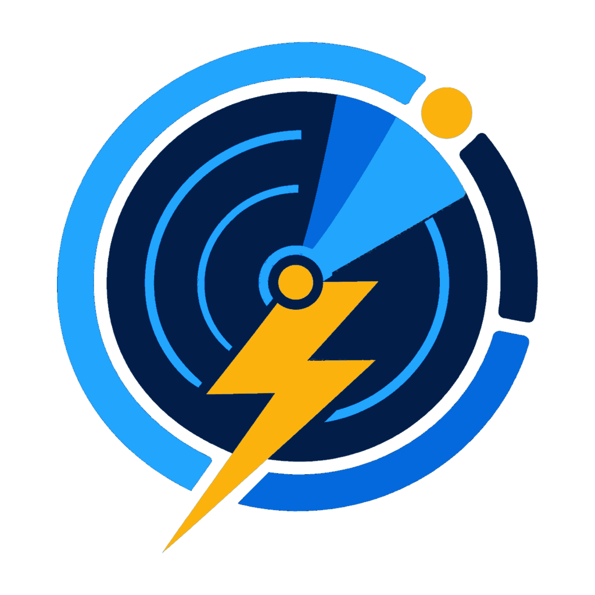
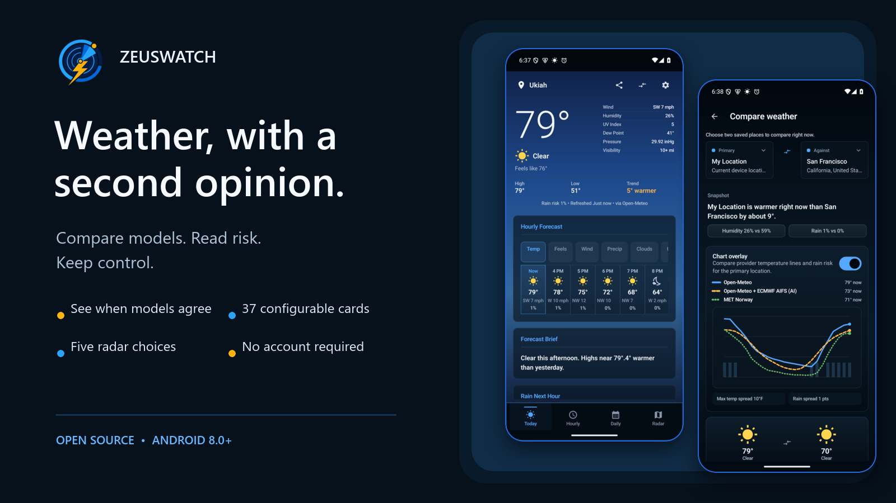
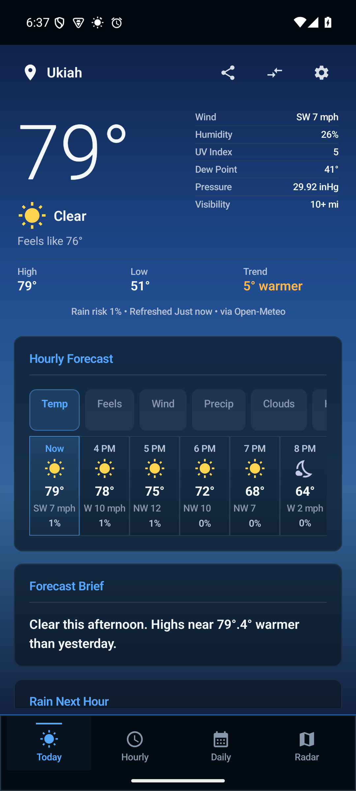
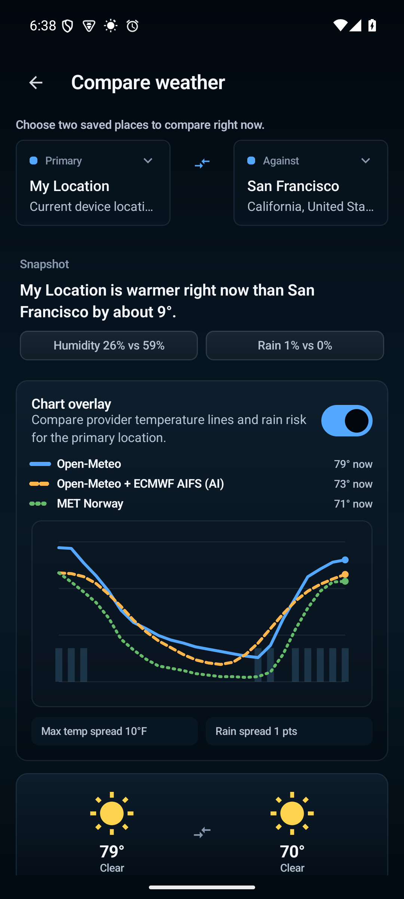
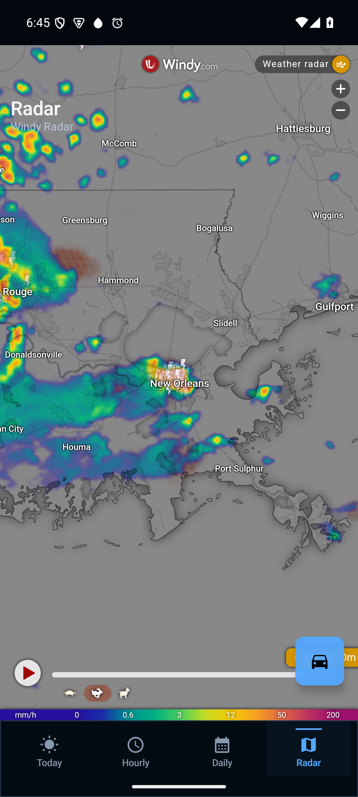
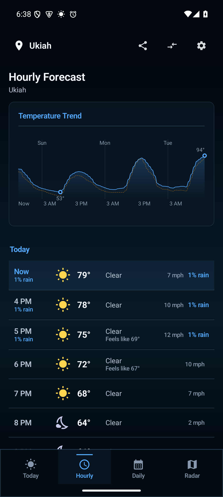
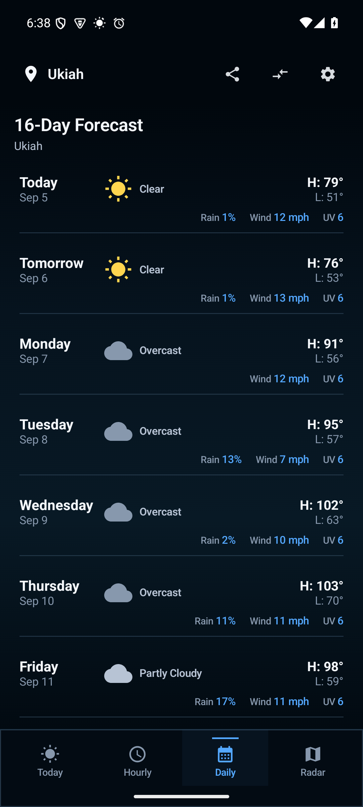
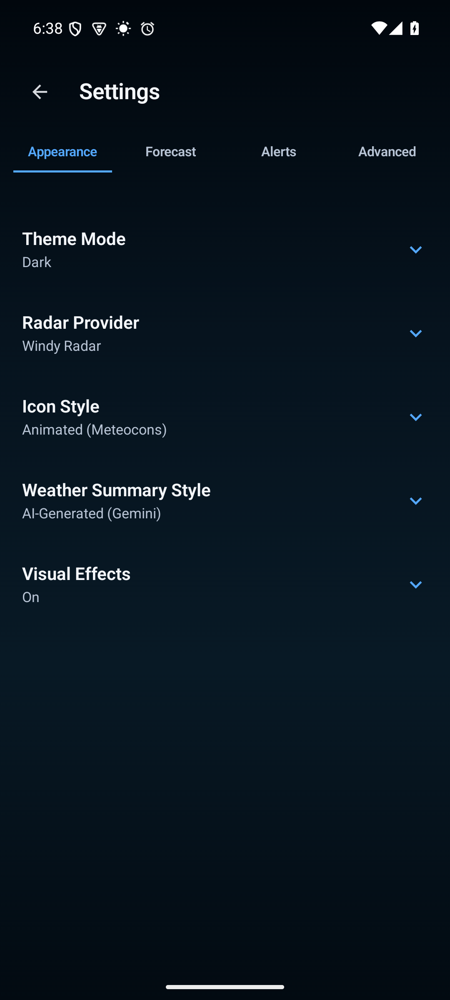
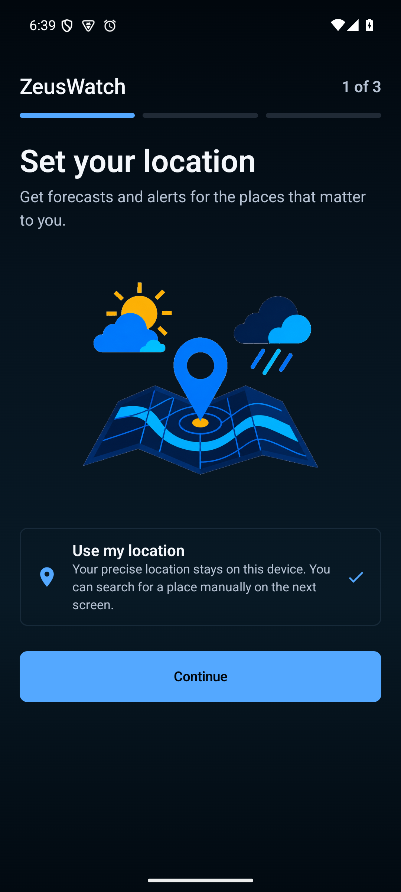
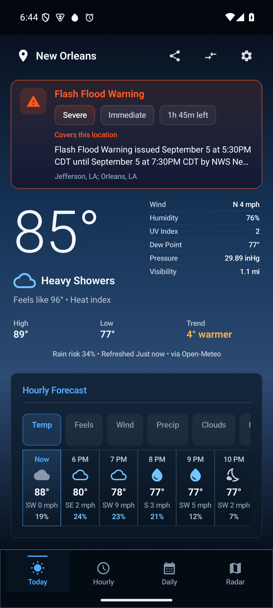

<p align="center">
  
</p>

<h1 align="center">ZeusWatch</h1>

<p align="center"><strong>Weather, with a second opinion.</strong></p>

<p align="center">Compare forecast models, understand risk, and keep control of your weather data.</p>


[](docs/screenshots/zeuswatch-hero.png)

Most weather apps turn uncertain model data into one confident answer. ZeusWatch lets you inspect the answer. Compare locations and providers, see when models disagree, and choose the sources you trust. Core use needs no account, subscription, or API key.

**[Download ZeusWatch](https://github.com/SysAdminDoc/ZeusWatch/releases/latest)** · [See the product](#product-tour) · [Build it](#build-from-source) · [Read the privacy policy](#privacy)

## Why ZeusWatch

| What you get | Why it matters |
|---|---|
| **Forecast comparison** | Put two locations side by side and inspect agreement across Open-Meteo, ECMWF AIFS, MET Norway, and other configured sources. |
| **Source visibility** | Choose forecast, radar, and alert providers. Provider health and redacted diagnostics help explain missing or stale data. |
| **A serious weather dashboard** | Reorder 37 weather cards, scan 72 hourly points, and open a dense 16-day outlook without digging through promotional screens. |
| **Private core use** | There are no ads or analytics. Forecasting works without an account, and cached data remains available offline. |

ZeusWatch is built for people who want more than a single temperature tile. It is useful for travel planning, outdoor work, photography, storm awareness, and anyone who checks two weather apps because one answer is not enough.

## Product tour

| Today | Compare | Radar |
|:---:|:---:|:---:|
| [](docs/screenshots/phone-home.png) | [](docs/screenshots/phone-compare.png) | [](docs/screenshots/phone-radar.png) |

| Hourly | Daily | Settings |
|:---:|:---:|:---:|
| [](docs/screenshots/phone-hourly.png) | [](docs/screenshots/phone-daily.png) | [](docs/screenshots/phone-settings.png) |

| First run | Live warning |
|:---:|:---:|
| [](docs/screenshots/phone-onboarding.png) | [](docs/screenshots/phone-warning.png) |

Setup covers location and units first. You also choose how dense the dashboard should be. There is no forced account screen.

These images come from a signed release build with live weather data. They are product captures, not interface mockups.

## What makes it different

### Check model agreement

The Compare screen shows two places at once and identifies the models behind each forecast. The provider-agreement card looks at the next 24 hours and calls out meaningful differences in temperature or rain risk. Confidence bands can use ICON, Google WeatherNext 2, or ECMWF AIFS-ENS.

### Read the forecast quickly

- Today combines current conditions, short-range changes, warnings, and the cards you choose.
- Hourly covers up to 72 hours with a chart, rain probability, wind, and compact rows.
- Daily keeps 16 days visible in a scan-friendly table.
- Weather-adaptive color remains readable while the static dark theme stays available.

### Choose the source

Forecast, air quality, radar, and alert sources can be selected independently. Saved locations can keep their own provider choices. Automatic fallback helps when a regional service is unavailable, while the provider-health panel records what happened without exposing coordinates, URLs, or keys.

### Keep the dashboard yours

All 37 home cards can be shown, hidden, and reordered. Units, alert thresholds, icon style, themes, and provider choices are configurable. Settings exports preserve those choices for another device.

## Download

Most current Android phones should use the standard `arm64-v8a` APK.

| Package | Use it for |
|---|---|
| [`ZeusWatch-v1.29.4-standard-arm64-v8a.apk`](https://github.com/SysAdminDoc/ZeusWatch/releases/latest/download/ZeusWatch-v1.29.4-standard-arm64-v8a.apk) | Current Android phones with Google Play Services |
| `ZeusWatch-v1.29.4-standard-armeabi-v7a.apk` | Older 32-bit Android phones |
| `ZeusWatch-v1.29.4-standard-universal.apk` | One standard APK for either phone architecture |
| [`ZeusWatch-v1.29.4-freenet-arm64-v8a.apk`](https://github.com/SysAdminDoc/ZeusWatch/releases/latest/download/ZeusWatch-v1.29.4-freenet-arm64-v8a.apk) | Current phones without proprietary Google dependencies |
| `ZeusWatch-v1.29.4-freenet-armeabi-v7a.apk` | Older 32-bit phones without Google dependencies |
| `ZeusWatch-v1.29.4-freenet-universal.apk` | One Google-free APK for either phone architecture |
| [`ZeusWatch-v1.29.4-wear.apk`](https://github.com/SysAdminDoc/ZeusWatch/releases/latest/download/ZeusWatch-v1.29.4-wear.apk) | Wear OS companion |

Every release includes all seven signed APKs, `SHA256SUMS.txt`, provenance data, and open-source notices. The complete set is on the [latest release page](https://github.com/SysAdminDoc/ZeusWatch/releases/latest).

For Obtainium, use one of these filters:

```text
^ZeusWatch-v[0-9.]+-standard-arm64-v8a\.apk$
^ZeusWatch-v[0-9.]+-freenet-arm64-v8a\.apk$
^ZeusWatch-v[0-9.]+-wear\.apk$
```

### Verify a download

Release signing certificate SHA-256:

```text
FB:03:10:AA:52:0F:6C:C6:EB:DA:04:61:71:9E:A9:22:40:EA:2B:4A:A1:D0:15:79:A9:D1:8A:F5:A9:5F:A7:CD
```

Check hashes and signatures before installing:

```bash
sha256sum -c SHA256SUMS.txt
apksigner verify --verbose --print-certs ZeusWatch-v1.29.4-standard-arm64-v8a.apk
apksigner verify --verbose --print-certs ZeusWatch-v1.29.4-freenet-arm64-v8a.apk
apksigner verify --verbose --print-certs ZeusWatch-v1.29.4-wear.apk
```

The provenance file records the source commit, toolchain versions, APK hashes, certificate fingerprint, and local verification commands used for that release.

## Forecasts, maps, and alerts

### Forecast sources

| Source | Coverage |
|---|---|
| **Open-Meteo and its model catalog** | Global forecasts, ensembles, history, air quality, pollen, and short-range rain data |
| **MET Norway** | Global forecast option |
| **Environment Canada** | Canadian forecasts and warnings |
| **Finnish Meteorological Institute** | HARMONIE forecasts for Finland and nearby regions |
| **GeoSphere Austria** | INCA nowcasts for Austria and the Alpine region |
| **Bright Sky** | DWD-based German forecasts |
| **OpenWeatherMap and Pirate Weather** | Optional key-based fallback sources |

Regional alert routing includes NWS, MeteoAlarm, JMA, Environment Canada, Hong Kong Observatory, BMKG, and WMO SWIC. ZeusWatch can select a source from the current country or use the one you specify.

### Radar choices

- **Windy Radar** provides the default interactive global view.
- **LibreWXR Native** adds high-resolution FOSS playback, nowcast tiles, lightning, and overlays.
- **RainViewer Native** provides past-radar playback on the native MapLibre map.
- **NWS Radar (US)** opens the official NOAA/NWS regional experience.
- **NWS Radar Lite (US)** keeps the official view usable on slower connections.

Lightning data from Blitzortung is informational and not for protection of life or property. Strikes can be late, missing, or inaccurate. Always follow official warnings and local emergency guidance.

### Alerts and planning

ZeusWatch handles severe-weather warnings, custom threshold rules, driving hazards, pollen thresholds, and weather-related health cues. A route planner can sample weather along a straight-line corridor or an imported GPX track. Its timing is an estimate, not navigation guidance.

## Phone, watch, and widgets

The Wear OS companion shows current conditions, hourly and daily forecasts, warnings, a tile, and complications. Phone-to-watch sync prefers cached phone data and can fall back to a direct forecast when the phone is unavailable.

### Widgets (Jetpack Glance)

| Widget | Size | What it shows |
|---|---:|---|
| **Small** | 2x1 | Temperature, icon, location, and high or low |
| **Medium** | 3x2 | Current conditions and a three-day forecast |
| **Large** | 4x3 | Current conditions, hourly weather, and five daily rows |
| **Forecast Strip** | 4x1 | Current temperature and the next five hourly points |
| **Saved Cities** | 4x3 | Conditions across saved locations |
| **Temperature** | 1x1 | Temperature and weather icon |
| **Compact** | 2x1 | Temperature, icon, and daily high or low |
| **Daily Forecast** | 4x2 | A seven-day outlook |

The app also supports a live weather wallpaper, Smartspacer data, Gadgetbridge broadcasts, and shareable weather cards.

---

## Privacy

ZeusWatch has no ads and no analytics SDK. Core forecasts need no account. Location access is requested only when you choose current-location weather, and the app uses foreground-only location. Saved places and forecast caches stay on the device.

Optional features have clear boundaries:

- Community weather reports use anonymous Firebase Authentication and send the report content you submit.
- API keys for optional providers are encrypted on the device with Tink AEAD.
- Exported provider diagnostics omit coordinates, URLs, and keys.
- The `freenet` flavor removes Firebase and Google Play Services dependencies.

## Integrations and data access

- `zeuswatch://` deep links open locations, radar, settings, and weather views.
- A read-only `content://com.sysadmindoc.nimbus.provider.weather/` provider exposes cached data to tools such as Tasker and KWGT after the caller receives the required permission.
- Settings can be exported and imported without including provider API keys.
- Share targets can send a formatted forecast or a rendered weather image.

## Architecture

| Area | Implementation |
|---|---|
| Interface | Jetpack Compose with Material 3 and weather-adaptive themes |
| Networking | Retrofit, OkHttp, Kotlin serialization, and Open-Meteo FlatBuffers support |
| Storage | Room Database (v5), DataStore, encrypted API-key storage, and provider-aware caches |
| Maps | MapLibre native radar plus provider WebViews where required |
| Background work | WorkManager for forecasts, widgets, warnings, and companion sync |
| Companion surfaces | Glance widgets, Wear OS tiles and complications, Smartspacer, and Gadgetbridge |
| Brand archive | Approved master and twelve original logo directions under `assets/brand` |

**Stack:** Gradle 9.5.0, Android Gradle Plugin 9.3.2, Kotlin 2.3.21, Jetpack Compose 2026.08.00, Hilt 2.60.1, Retrofit 3.0.0, OkHttp 5.5.0, Room 2.8.4, DataStore 1.2.1, MapLibre 13.3.1, Glance 1.2.0, WorkManager 2.11.2, Lottie 6.7.1, Coil 3.6.0, Firebase Firestore 34.18.0.

## Build from source

Requirements:

- Android Studio with Android Gradle Plugin 9.3 support
- JDK 17 or newer
- Android SDK 37

Build a debug APK:

```bash
git clone https://github.com/SysAdminDoc/ZeusWatch.git
cd ZeusWatch
./gradlew assembleStandardDebug
```

Run the complete local check set:

```bash
./gradlew localQualityGate
```

Build signed release packages after adding the local keystore settings described in [`docs/RELEASE.md`](docs/RELEASE.md):

```bash
./gradlew clean assembleStandardRelease assembleFreenetRelease :wear:assembleRelease
python tools/stage_release_assets.py
```

## Contributing

Issues and focused pull requests are welcome. Please run `./gradlew localQualityGate` before sending a change. Provider behavior and safety wording should be backed by the upstream service documentation.

## License and attribution

ZeusWatch is licensed under [LGPL-3.0](LICENSE).

Forecast and map data remain subject to their providers' terms. Major sources include Open-Meteo, MET Norway, Environment Canada, DWD through Bright Sky, RainViewer, Windy, NOAA/NWS, MeteoAlarm, JMA, and Blitzortung. Weather icons use Meteocons by Bas Milius under the MIT License.
